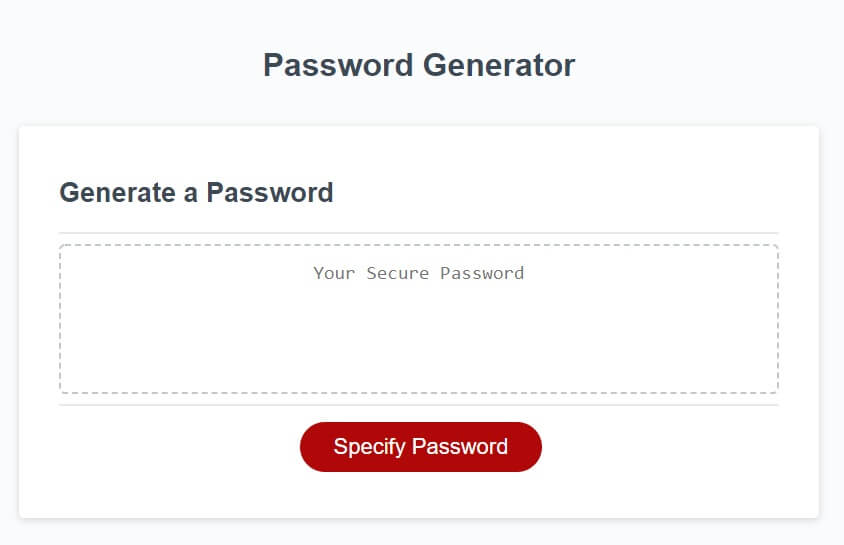

# Password Generator

## Description

This password generator helps design and create a random and secured password for the user. They have the option to include (or exclude) types of characters available, such as symbols, numbers, capital, or lowercase letters.

## Features

Generates a password to the user's specifications. The password may be 8 to 128 characters long, and has four sets of characters that may be included: "special"(symbols), numbers, capital letters, and lowercase letters. The form will indicate whether the configuration made by the user is possible: invalid password length, or an absence of any character set selected, will result in a red button and alert() if still submitted. The text area selects all text and copies it to your clipboard (complete with popup) when clicked.

**this project initially had a series of prompt() and confirm()s to calibrate password to the user's likening. However, I found that to be a poor user experience and transformed the project into a snazzy form instead. I see no reason why this should net a lower score, but I have linked the original code below if my decision to go beyond is questioned.**

[Proof of original code](https://github.com/Axeljk/uw_m03_password/commit/fb0577293062f78b7a148c344724d546fb14eab1).

# Installation

Visit [this link](https://axeljk.github.io/uw_m03_password) to view the page.

## Credits

- Axel Kern, creator
- W3Schools, reference for HTML, CSS, and JS help
- Stackoverflow for direction on how to solve specific problems
- Abbey Free, supporting me in all things